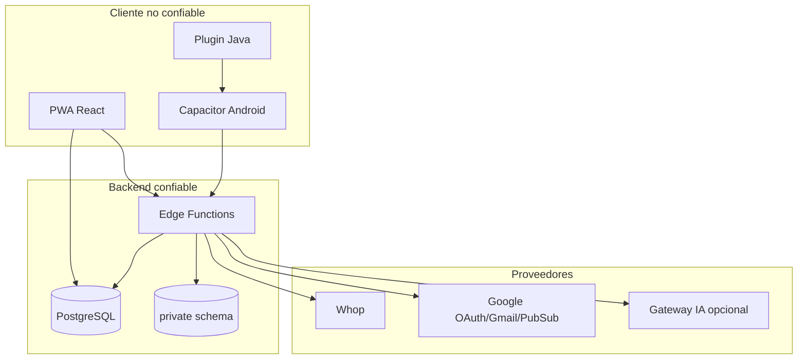
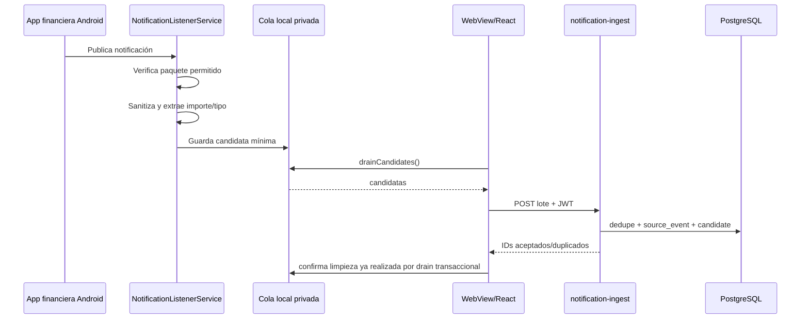
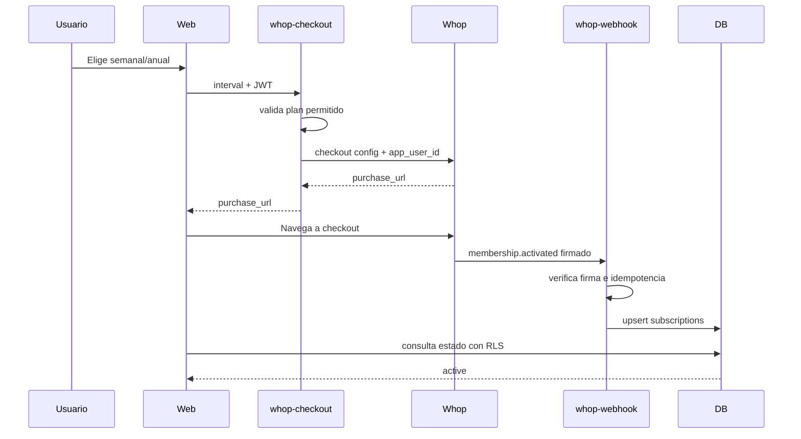

# Arquitectura técnica — CapitalFlow MVP

## 1. Decisión principal

La solución de referencia es una aplicación React/Vite que se publica de dos maneras:

- **PWA:** misma aplicación servida por HTTPS, instalable desde el navegador.
- **Android:** build web dentro de Capacitor, con un plugin Java para acceder al sistema de notificaciones.

El backend usa Supabase porque combina Auth, PostgreSQL, RLS, funciones serverless y cron con un modelo fácil de portar. La lógica de dominio vive en `packages/core` para que Codex, Lovable, Replit o Base44 puedan reutilizarla aunque cambie el backend.

## 2. Límites de confianza



El cliente puede enviar datos, pero nunca determina su propia identidad, vigencia de suscripción, acceso a otro usuario, validez de webhook o autorización OAuth.

## 3. Monorepo

```text
capitalflow-mvp/
├── AGENTS.md
├── docs/
├── packages/core/
├── apps/web/
├── supabase/
├── native/android/
└── scripts/
```

### `packages/core`

- No depende de React, Capacitor, Supabase o red.
- Contiene tipos de dominio, parser monetario, clasificación, sanitización, deduplicación, interés compuesto, escenarios de riesgo y asignación.
- Se prueba con Node Test Runner.

### `apps/web`

- React, TypeScript y Vite.
- Supabase Auth/Data API.
- PWA mediante manifest y service worker.
- Adaptador Capacitor `NotificationAccess`.
- Páginas de dashboard, transacciones, metas, inversiones, asesor, integraciones y suscripción.

### `supabase`

- Migraciones SQL.
- RLS, vistas y RPC atómica.
- Edge Functions para integraciones.
- Esquema `private` no expuesto para credenciales, webhooks, jobs y auditoría.

### `native/android`

- Fuentes Java que se copian al proyecto generado por Capacitor.
- Listener, parser local, cola privada y bridge.

## 4. Flujo de datos Android



La cola debe implementar una operación de reserva/confirmación o conservar respaldo hasta recibir 2xx. El scaffold usa `peekCandidates` y `ackCandidates` para evitar pérdida ante fallos.

## 5. Flujo Gmail

1. `gmail-oauth-start` autentica al usuario y firma `state`.
2. Google devuelve `code` a `gmail-oauth-callback`.
3. Callback valida `state`, canjea tokens y cifra credenciales.
4. `gmail-sync` obtiene mensajes iniciales o cambios mediante cursor/history.
5. El parser utiliza asunto, remitente, snippet y partes de texto necesarias.
6. Se almacena una evidencia sanitizada, nunca el token.
7. `users.watch` publica cambios en Pub/Sub.
8. `gmail-pubsub-webhook` valida el mensaje y ejecuta sync incremental.
9. Cron renueva el watch antes de `expiration`.

## 6. Flujo Whop



El retorno del checkout es solo experiencia de usuario. La activación depende del webhook.

## 7. Modelo de autorización

- `auth.users.id` es la identidad raíz.
- Todas las tablas públicas incluyen `user_id` o usan una relación que llega al usuario.
- Política `SELECT`: propietario; categorías del sistema son visibles para todos los autenticados.
- Política de escritura: propietario y `has_active_subscription(auth.uid())`.
- `subscriptions` es solo lectura para el usuario; solo backend actualiza.
- `source_connections` es lectura del propietario; credenciales están en `private.oauth_credentials`.
- La eliminación de cuenta utiliza función privilegiada y auditable.

## 8. Idempotencia

| Operación | Clave |
|---|---|
| Whop webhook | `webhook-id` / event ID |
| Gmail message | provider + external message ID |
| Android notification | fingerprint estable + ventana |
| Checkout | user + interval + ventana/idempotency key |
| Aceptar candidata | `candidate_id` único con `created_transaction_id` |
| Aporte a meta | `transaction_id` único cuando existe |

## 9. Retención y minimización

- Tokens: hasta desconexión/revocación; siempre cifrados.
- Cuerpo de email: memoria de proceso; no persistir por defecto.
- Notificación cruda: no persistir; guardar texto sanitizado corto.
- Candidatos rechazados: 30 días por defecto; configurable en `private.retention_policy`.
- Eventos dedupe: 90 días por defecto; configurable en `private.retention_policy`.
- Auditoría: periodo definido legalmente; no incluir contenido financiero. El purge automático no elimina `private.audit_events` mientras ese periodo siga pendiente de aprobación legal.
- Advisor inputs: conservar solo si el usuario acepta historial; permitir borrar.

## 10. Observabilidad

- Correlation ID por request y sync.
- Métricas: duración, mensajes leídos, candidatos creados, duplicados, errores y renovaciones.
- Logs: provider, status, error code y IDs internos; nunca token/body.
- Alertas: webhook inválido repetido, renovación próxima fallida, cola atascada, error rate, RLS test failure.

## 11. Estrategia offline

P0:

- service worker cachea shell y assets con estrategia cache-first/versionada;
- datos recientes pueden conservarse en memoria/local storage segura para lectura;
- la interfaz muestra “última sincronización”.

P1:

- IndexedDB con cola de comandos idempotentes;
- resolución de conflictos por versión/`updated_at`;
- cifrado local para datos sensibles cuando sea viable;
- background sync cuando el navegador lo permita.

## 12. Adaptación a otras plataformas de IA

- **Lovable:** mantener React/Vite/Supabase; importar SQL, core y páginas.
- **Replit:** ejecutar el monorepo; opcionalmente reemplazar Edge Functions por Express/Fastify manteniendo OpenAPI.
- **Base44:** recrear tablas y endpoints desde PRD/OpenAPI; conservar parsers como funciones TypeScript.
- **Codex:** trabajar por tareas en `TECHNICAL_TASKS.md`, ejecutar pruebas y no romper reglas de `AGENTS.md`.

La parte Android siempre requiere exportar o mantener código nativo; un constructor puramente web no puede sustituir `NotificationListenerService`.

## 13. Portabilidad de datos e importación

El archivo se procesa primero en el cliente para minimizar transferencia de información cruda:

```text
CSV / XLSX / XLS / TSV / JSON
          ↓
parser local + detección de encabezados
          ↓
mapeo / preview
          ↓
normalización a unidades menores
          ↓
lotes de hasta 400 filas
          ↓
import-transactions
          ↓
validación server-side + resolución de cuenta/categoría
          ↓
SHA-256 import_key + deduplicación
          ↓
transactions(source=import_file)
```

El backend no conserva el Excel/CSV original. `data_imports` almacena nombre, tipo, hash del archivo, mapeo y métricas. Esto reduce superficie de datos y permite auditar qué ocurrió sin convertir CapitalFlow en repositorio de archivos fuente.

## 14. Backup y restore anual

La conexión de almacenamiento usa credenciales separadas de las conexiones de correo.

```text
Plan anual verificado
        ↓
storage-oauth-start
        ↓
Google drive.appdata
        ↓
storage_connections + encrypted storage_oauth_credentials
        ↓
cloud-backup-create / cloud-backup-worker
        ↓
buildBackupDocument()
        ↓
capitalflow-backup-v2 + SHA-256
        ↓
Google appDataFolder
```

Restore:

```text
backup seleccionado
      ↓
download remoto
      ↓
checksum + schema v2
      ↓
crear pre_restore del estado actual
      ↓
private.restore_user_backup(...)
      ↓
transacción PostgreSQL
```

El archivo excluye entitlement Whop, OAuth, webhooks, correo crudo y otras credenciales. El restore no puede convertir una cuenta semanal en anual ni importar tokens externos.

### Permisos mínimos

- Google Drive: `https://www.googleapis.com/auth/drive.appdata`; el archivo se crea con `parents:["appDataFolder"]`.

`cloud-storage.ts` es la frontera del proveedor. Agregar otro almacenamiento debe implementarse detrás de esa frontera y no alterar el dominio financiero ni `capitalflow-backup-v2`.


## 15. Onboarding autónomo y espacios de cuenta

### 15.1 Gate persistente

```text
Auth + suscripción activa
        ↓
OnboardingGate
        ↓
monedas → cuenta principal → Gmail → permiso Android → calibración
        ↓
profiles.onboarding_completed + onboarding_state.completed_at
        ↓
AppShell / dashboard
```

`onboarding_state` desacopla el progreso del navegador, por lo que OAuth, recargas y reinicios no reinician el proceso. En PWA pura el permiso de notificaciones externas se marca como no aplicable; en APK es requisito antes de terminar. Si no existen tres ejemplos recientes, una búsqueda de calibración sin pendientes permite finalizar y el aprendizaje continúa después.

### 15.2 Bucle de aprendizaje

```text
señal nueva
  ↓
parser + dedupe
  ↓
reglas fuente→cuenta / comercio→categoría
  ↓
¿resolución segura? ── sí ──> ledger automático
  │
  no
  ↓
excepción puntual → usuario corrige una vez
  ↓
aprender regla
  ↓
reprocessPendingCandidates()
  ↓
resolver automáticamente excepciones similares
```

La telemetría de autonomía está en `private.automation_metrics_30d`, sin grants a `authenticated`; nunca forma parte del contrato del frontend.

### 15.3 Cuentas por entitlement

`accounts` incorpora `is_primary`, `purpose`, `purpose_label` y `archived_at`. `account-manage` y el trigger `private.enforce_account_plan()` aplican la misma política:

- semanal: una sola cuenta activa y principal;
- anual: principal + secundarias;
- principal: no archivable;
- secundarias: archivables/restaurables sin borrado.

`listAccounts()` devuelve activas para operación. `listAllAccounts()` se usa en administración, filtros históricos y backup. `loadDashboardSummary(accountId)` permite un ámbito independiente: si se selecciona una cuenta, solo consulta sus transacciones y usa su moneda como moneda de presentación. `BACKUP_TABLES` ya incluye `accounts` con `select(*)`, de modo que activas y archivadas se conservan sin lógica especial adicional.

Cuando el entitlement efectivo queda en semanal, el webhook de Whop archiva automáticamente las secundarias activas sin borrar movimientos. Si existe cualquier membresía anual activa y no vencida, el entitlement anual tiene precedencia.

## T13 final hardening boundary

The shared Edge HTTP boundary no longer uses wildcard CORS. Browser preflights are accepted only when `Origin` exactly matches the normalized HTTP(S) origin from `APP_URL`; missing or invalid configuration fails closed. The PWA service worker caches only the application shell, hashed `/assets/`, and explicit install assets, never arbitrary same-origin responses.

Production web builds derive CSP and security headers from `apps/web/security-policy.ts`. Static hosts receive `public/_headers`; the Vite production build also injects a CSP meta fallback and preview serves the same headers.

Operational health is exposed only through `public.service_operational_health()` to `service_role` and through the custom-auth `health-status` Edge Function protected by `CRON_SECRET`. The response exposes aggregate counts/status only, never tokens, user identifiers, message bodies, or financial content.
