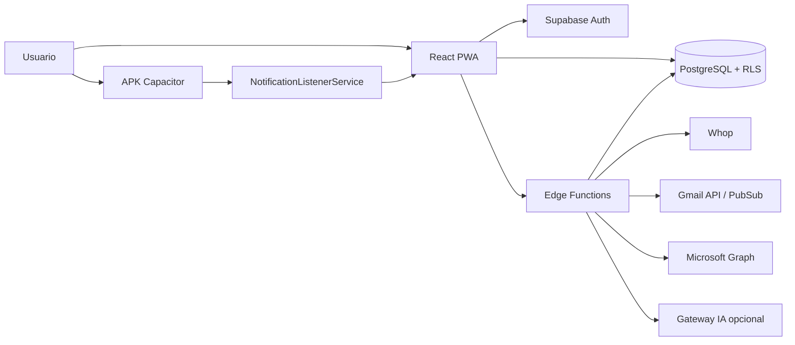

# PRD — CapitalFlow

**Versión:** 1.0  
**Estado:** MVP listo para implementación  
**Fecha de referencia:** 12 de agosto de 2026  
**Plataformas:** PWA web instalable + APK Android mediante Capacitor  
**Modelo comercial:** solo suscripción paga, semanal o anual, procesada por Whop  
**Stack de referencia:** React + TypeScript + Vite + Capacitor + Supabase/PostgreSQL + Edge Functions

---

## 1. Resumen ejecutivo

CapitalFlow es una aplicación de finanzas personales que permite registrar y entender ingresos, gastos, metas de ahorro e inversiones sin conectarse a APIs bancarias ni a APIs de plataformas de pago. El producto captura datos mediante cuatro vías:

1. ingreso manual;
2. notificaciones de aplicaciones Android autorizadas por el usuario;
3. correos de Gmail vinculados por OAuth;
4. correos de Outlook/Microsoft 365 vinculados por OAuth.

Los eventos detectados se convierten en señales financieras normalizadas. Las señales inequívocas se deduplican, asignan y contabilizan automáticamente; solo las excepciones ambiguas pasan a revisión. Cada corrección puede crear reglas privadas fuente→cuenta y comercio→categoría, y el backend vuelve a evaluar excepciones pendientes para reducir progresivamente la necesidad de intervención.

La aplicación incluye un asesor determinista que distribuye el dinero disponible entre obligaciones, reserva de emergencia, metas e inversión según prioridades, horizonte y tolerancia al riesgo. Una capa opcional de IA puede explicar el resultado, pero no realiza cálculos, no inventa rentabilidades y no recibe correos o notificaciones crudas.

La interfaz funciona como PWA en navegador. Para leer notificaciones de otras aplicaciones en Android se requiere un contenedor nativo Capacitor con `NotificationListenerService`; esa capacidad no existe en una PWA pura.

---

## 2. Objetivo del producto

### 2.1 Objetivo principal

Ayudar al usuario a consolidar, clasificar y administrar su flujo de dinero con el menor esfuerzo manual posible, manteniendo control explícito sobre la información detectada y ofreciendo escenarios comprensibles para ahorro, inversión e interés compuesto.

### 2.2 Resultados esperados

- Disminuir el tiempo de registro manual de movimientos.
- Aumentar la visibilidad del flujo de caja real.
- Hacer medible el progreso hacia metas.
- Permitir seguimiento manual de inversiones y rentabilidad.
- Transformar ingresos disponibles en un plan de asignación priorizado.
- Validar disposición de pago mediante suscripciones semanales y anuales sin plan gratuito.

### 2.3 Métricas de éxito del MVP

| Métrica | Meta inicial |
|---|---:|
| Usuarios que completan registro y checkout | >= 35% de los registros iniciados |
| Usuarios que crean al menos una cuenta/categoría/transacción | >= 70% de suscriptores activos |
| Excepciones detectadas aceptadas, corregidas o descartadas | >= 70% |
| Precisión de importe y moneda en candidatos confirmados | >= 95% |
| Precisión de tipo ingreso/gasto después de corrección | >= 85% |
| Usuarios que crean al menos una meta | >= 40% |
| Usuarios que ejecutan el asesor en la primera semana | >= 40% |
| Duplicados confirmados en el libro | < 1% |
| Errores de sincronización no recuperados | < 2% de sincronizaciones |
| Retención de suscripción al segundo ciclo | medir, no fijar antes de validar precio |

---

## 3. Usuarios objetivo

### Persona A — Profesional con múltiples medios de pago

- Recibe ingresos por salario, honorarios o transferencias.
- Usa bancos, billeteras y tarjetas diferentes.
- Quiere entender adónde se va el dinero sin registrar todo manualmente.
- Tiene poca tolerancia a configuraciones complejas.

### Persona B — Ahorrador orientado a metas

- Quiere ahorrar para viaje, estudio, vivienda, emergencia o compra específica.
- Necesita saber cuánto debe aportar periódicamente y si llegará a la fecha objetivo.
- Valora barras de progreso, recordatorios y escenarios.

### Persona C — Inversionista principiante o intermedio

- Registra inversiones de manera manual.
- Quiere ver capital aportado, valor actual y rentabilidad.
- Busca comprender relación entre riesgo, plazo, aportes e interés compuesto.
- No necesita trading ni integración con corredores en el MVP.

### Persona D — Usuario preocupado por privacidad

- No desea entregar credenciales bancarias.
- Acepta autorizar notificaciones o correo solo si entiende exactamente qué se procesa.
- Espera poder desconectar fuentes, borrar datos y revisar únicamente las excepciones antes de que una decisión dudosa afecte el libro.

---

## 4. Problemas a resolver

1. Los movimientos financieros se encuentran dispersos entre notificaciones, correos y memoria del usuario.
2. El registro manual completo consume tiempo y suele abandonarse.
3. Los usuarios confunden saldo disponible con dinero realmente utilizable después de obligaciones y metas.
4. Las metas de ahorro carecen de una ruta periódica concreta.
5. Las inversiones manuales suelen registrarse sin una medición consistente de rentabilidad.
6. Las recomendaciones genéricas de internet no consideran flujo de caja, horizonte, tolerancia al riesgo ni prioridad de metas.
7. Conectar cuentas bancarias mediante agregadores puede ser costoso, no estar disponible en todos los países o generar desconfianza.
8. Un producto de prueba necesita distribuirse en Android sin depender inicialmente de una publicación en Google Play.

---

## 5. Principios de producto

1. **Consentimiento explícito:** ninguna fuente se conecta o lee sin una acción clara del usuario.
2. **Automatización por excepción:** una señal de alta confianza puede contabilizarse sin intervención; la revisión humana se reserva para ambigüedad, conflicto o baja confianza.
3. **Privacidad mínima:** conservar solo los datos necesarios; eliminar o no almacenar contenido bruto cuando no sea indispensable.
4. **Cálculo determinista:** importes, proyecciones y asignaciones deben poder reproducirse y probarse.
5. **IA subordinada:** la IA explica; no reemplaza reglas, cifras ni validaciones.
6. **Portabilidad:** lógica de dominio desacoplada de UI, proveedor de IA y plataforma de despliegue.
7. **Sin APIs bancarias:** no se solicitan claves, contraseñas ni conexiones directas con bancos.
8. **Transparencia de riesgo:** ninguna rentabilidad se presenta como garantizada.
9. **Libro inmutable en lo esencial:** cambios sensibles deben dejar trazabilidad.
10. **Pagado desde el inicio:** no hay freemium; solo quedan fuera del paywall el registro, checkout, recuperación, privacidad y eliminación de cuenta.

---

## 6. Alcance del MVP

### 6.1 Incluido — P0

- Registro, inicio de sesión, recuperación y cierre de sesión.
- Perfil, moneda base, zona horaria y preferencias.
- Paywall y suscripción semanal/anual con Whop.
- Estado de membresía actualizado por webhooks.
- Cuentas financieras manuales: efectivo, cuenta, billetera, tarjeta prepago u otra.
- Ingresos, gastos y transferencias manuales.
- Categorías del sistema y categorías personalizadas.
- Captura Android con filtrado financiero local; por defecto puede descubrir señales en las notificaciones autorizadas por Android y permite una allowlist avanzada opcional.
- Vinculación Gmail y Outlook mediante OAuth.
- Sincronización inicial e incremental de correos.
- Bandeja de excepciones para señales que no pudieron resolverse con seguridad: aceptar, corregir, categorizar, rechazar y marcar duplicado.
- Reglas simples de categorización aprendidas de correcciones del usuario.
- Metas de ahorro, aportes y progreso.
- Inversiones manuales, valor actual, retorno absoluto y porcentual.
- Obligaciones o gastos recurrentes para alimentar el asesor.
- Asesor determinista de asignación.
- Explicación opcional mediante IA.
- PWA instalable, funcionamiento básico sin conexión y cola de sincronización.
- Exportación básica de datos a JSON/CSV.
- Desconexión de fuentes y eliminación de cuenta.
- Auditoría técnica de webhooks, OAuth y acciones sensibles.

### 6.2 Incluido — P1 posterior al MVP

- División de una transacción entre varias categorías.
- Presupuestos mensuales por categoría.
- Reglas avanzadas por comercio, texto, importe y rango horario.
- Notificaciones propias de vencimientos, metas y desviaciones.
- Cuentas compartidas o familiares.
- Importación OFX/QIF adicional (CSV/TSV/Excel/JSON ya está incluida en P0).
- Panel de métricas de cohortes y retención.
- Recomendaciones de productos financieros específicas solo con fuentes autorizadas, datos vigentes y revisión legal.

### 6.3 Fuera de alcance

- Conexión a APIs bancarias, open banking o scraping de portales bancarios.
- Ejecución de inversiones, compra de activos o envío de órdenes.
- Custodia de dinero, billetera propia o transferencias.
- Asesoría financiera fiduciaria o garantía de rendimiento.
- Lectura de SMS en el MVP.
- iOS con lectura de notificaciones de otras aplicaciones.
- Contabilidad empresarial, facturación o impuestos.
- Préstamos, scoring crediticio o seguros.
- Freemium, pruebas gratuitas o anuncios.

---

## 7. Restricciones y decisiones técnicas

### 7.1 PWA frente a Android nativo

- La PWA proporciona instalación desde navegador, actualización web y soporte multiplataforma.
- La lectura de notificaciones de otras apps requiere Android nativo.
- Se utilizará Capacitor para envolver la misma aplicación web y exponer un plugin Java.
- El APK de pruebas podrá instalarse por ADB o descargarse desde un sitio privado/directo.
- La versión PWA mostrará la integración Android como no disponible cuando se ejecute en navegador.

### 7.2 Correo sin APIs bancarias

- Gmail se integra con Gmail API mediante OAuth; Outlook con Microsoft Graph mediante OAuth.
- La app solicita el permiso mínimo que permita leer los mensajes necesarios.
- Los tokens se guardan cifrados y solo en backend.
- La producción pública de Gmail debe contemplar el proceso de verificación de permisos restringidos y la evaluación de seguridad aplicable.

### 7.3 Suscripciones

- Whop administra checkout, cobro, renovaciones y membresías.
- Se configuran dos planes recurrentes: 7 días y 365 días.
- El backend crea una configuración de checkout con `app_user_id` en metadata.
- Los webhooks son la fuente de verdad del acceso.
- El cliente nunca contiene la API key de Whop ni decide por sí solo que una suscripción está activa.

---

## 8. Flujos principales

### 8.1 Registro y activación

1. Usuario crea cuenta con correo y contraseña.
2. Confirma correo si la política lo exige.
3. Selecciona moneda base y zona horaria.
4. Llega al paywall.
5. Elige plan semanal o anual.
6. Backend crea checkout Whop con metadata de usuario.
7. Usuario paga en Whop.
8. Whop envía `payment.succeeded` y/o `membership.activated`.
9. Backend verifica firma, deduplica y actualiza `subscriptions`.
10. La app desbloquea el producto.

### 8.2 Registro manual

1. Usuario pulsa “Nuevo movimiento”.
2. Elige ingreso, gasto o transferencia.
3. Introduce importe, moneda, cuenta, fecha, categoría y descripción.
4. El sistema valida importe positivo y campos obligatorios.
5. Guarda la transacción y recalcula saldos y paneles.

### 8.3 Detección desde Android

1. Usuario instala APK y abre Integraciones.
2. La app explica el permiso de acceso a notificaciones.
3. Usuario concede acceso en ajustes Android.
4. Selecciona las aplicaciones cuyos avisos desea procesar.
5. `NotificationListenerService` recibe un aviso.
6. El parser local extrae datos mínimos y elimina fragmentos sensibles.
7. Guarda una señal financiera sanitizada en la cola local privada.
8. Al abrir o sincronizar la app, el plugin entrega la cola al frontend.
9. El backend deduplica, resuelve cuenta/categoría y aplica la política determinista: contabiliza una señal inequívoca o crea una `transaction_candidate` solo si es una excepción.
10. El usuario acepta, corrige o rechaza únicamente las excepciones; una corrección puede enseñar reglas y re-evaluar pendientes recientes.

### 8.4 Detección desde Gmail/Outlook

1. Usuario pulsa “Conectar”.
2. Backend genera URL OAuth con estado firmado.
3. Usuario concede permisos al proveedor.
4. Callback valida estado, intercambia código y cifra tokens.
5. Se realiza sincronización inicial limitada.
6. Se registra mecanismo incremental: Gmail watch/Pub/Sub o Microsoft Graph subscription/delta.
7. Los mensajes relevantes se deduplican y pasan por la política determinista de automatización.
8. Las señales inequívocas se contabilizan; solo las ambiguas o inseguras llegan a revisión para confirmar, corregir o rechazar.

### 8.5 Meta de ahorro

1. Usuario crea meta con nombre, importe, moneda y fecha objetivo.
2. El sistema calcula porcentaje y aporte periódico requerido.
3. Usuario registra aporte manual o vincula una transacción.
4. La barra de progreso y el faltante se actualizan.
5. El asesor prioriza metas según fecha, prioridad y faltante.

### 8.6 Inversión manual

1. Usuario crea una posición con capital inicial, tipo de activo, riesgo y fecha.
2. Introduce o actualiza valor actual.
3. El sistema calcula ganancia/pérdida absoluta y porcentual.
4. Si el usuario informa tasa esperada y horizonte, se muestra proyección compuesta con supuestos.

### 8.7 Asesor sin IA

1. Usuario selecciona horizonte y objetivo de rentabilidad.
2. Sistema reúne liquidez, ingresos esperados, gastos esenciales, reserva, metas e inversiones.
3. Ejecuta reglas deterministas.
4. Devuelve asignación recomendada, supuestos, advertencias y escenarios.
5. Usuario puede ajustar parámetros y comparar resultados.

### 8.8 Asesor con IA

1. El cálculo determinista ya existe.
2. Se envía únicamente un resumen financiero estructurado y anonimizado al gateway de IA.
3. La IA redacta explicación, preguntas de reflexión y riesgos.
4. La aplicación muestra que la explicación no garantiza resultados.
5. Se registra versión de prompt/modelo y se permite regenerar.

---

## 9. Requisitos funcionales

### Autenticación y perfil

| ID | Requisito | Prioridad |
|---|---|---|
| FR-AUTH-001 | Crear usuario con correo y contraseña. | P0 |
| FR-AUTH-002 | Iniciar y cerrar sesión. | P0 |
| FR-AUTH-003 | Recuperar contraseña. | P0 |
| FR-AUTH-004 | Guardar moneda base, idioma y zona horaria. | P0 |
| FR-AUTH-005 | Exportar datos y solicitar eliminación de cuenta. | P0 |
| FR-AUTH-006 | Permitir MFA en una fase posterior sin rediseñar el modelo. | P1 |

### Suscripciones

| ID | Requisito | Prioridad |
|---|---|---|
| FR-SUB-001 | Mostrar paywall después del registro si no existe membresía activa. | P0 |
| FR-SUB-002 | Ofrecer plan semanal y plan anual, sin opción gratuita. | P0 |
| FR-SUB-003 | Crear checkout desde backend con plan permitido y metadata del usuario. | P0 |
| FR-SUB-004 | Verificar webhooks Whop e impedir eventos duplicados. | P0 |
| FR-SUB-005 | Conceder acceso con estado `active` o equivalente válido. | P0 |
| FR-SUB-006 | Revocar escritura al vencer o desactivarse la membresía. | P0 |
| FR-SUB-007 | Mantener acceso a exportación, privacidad y eliminación aunque la suscripción esté inactiva. | P0 |
| FR-SUB-008 | Mostrar fecha de renovación y cancelación al final del periodo cuando esté disponible. | P0 |

### Cuentas y libro de movimientos

| ID | Requisito | Prioridad |
|---|---|---|
| FR-LED-001 | Crear, editar, archivar y listar cuentas manuales. | P0 |
| FR-LED-002 | Registrar ingreso, gasto y transferencia manual. | P0 |
| FR-LED-003 | Mantener importes en unidades monetarias menores. | P0 |
| FR-LED-004 | Calcular saldos por cuenta y flujo mensual. | P0 |
| FR-LED-005 | Editar o anular una transacción dejando auditoría. | P0 |
| FR-LED-006 | Filtrar por fecha, tipo, cuenta, categoría, fuente y texto. | P0 |
| FR-LED-007 | Evitar doble contabilización por huella de fuente. | P0 |
| FR-LED-008 | Exportar movimientos a CSV y JSON. | P0 |

### Categorías

| ID | Requisito | Prioridad |
|---|---|---|
| FR-CAT-001 | Proveer categorías iniciales para ingresos, gastos, metas e inversiones. | P0 |
| FR-CAT-002 | Permitir categorías personalizadas. | P0 |
| FR-CAT-003 | Permitir color/icono y archivado. | P0 |
| FR-CAT-004 | Aplicar reglas por comercio o patrón textual. | P0 |
| FR-CAT-005 | Sugerir guardar una regla al corregir un candidato. | P0 |

### Android y notificaciones

| ID | Requisito | Prioridad |
|---|---|---|
| FR-AND-001 | Detectar si el permiso de escucha está concedido. | P0 |
| FR-AND-002 | Abrir la pantalla de ajustes de acceso a notificaciones. | P0 |
| FR-AND-003 | Permitir una allowlist avanzada de paquetes; una lista vacía activa descubrimiento local automático y solo envía señales clasificadas como financieras. | P0 |
| FR-AND-004 | Extraer título, texto, texto expandido, paquete y fecha. | P0 |
| FR-AND-005 | Clasificar ingreso/gasto y extraer importe/moneda localmente. | P0 |
| FR-AND-006 | Guardar cola local privada y limitada. | P0 |
| FR-AND-007 | Sincronizar cola al backend y eliminarla tras confirmación de recepción. | P0 |
| FR-AND-008 | Procesar notificaciones localmente y no enviar al backend contenido que no supere el filtro financiero; si existe allowlist, limitarse a ella. | P0 |
| FR-AND-009 | Mostrar claramente que la función no está disponible en PWA web. | P0 |

### Gmail y Outlook

| ID | Requisito | Prioridad |
|---|---|---|
| FR-MAIL-001 | Conectar y desconectar Gmail mediante OAuth. | P0 |
| FR-MAIL-002 | Conectar y desconectar Outlook/Microsoft 365 mediante OAuth. | P0 |
| FR-MAIL-003 | Guardar tokens cifrados y refrescarlos en backend. | P0 |
| FR-MAIL-004 | Realizar sincronización inicial con límite temporal y paginación. | P0 |
| FR-MAIL-005 | Procesar cambios incrementales sin releer todo el buzón. | P0 |
| FR-MAIL-006 | Renovar watches/subscriptions antes de expirar. | P0 |
| FR-MAIL-007 | Generar señales solo para mensajes con evidencia financiera suficiente y aplicar la política de automatización por excepción. | P0 |
| FR-MAIL-008 | No conservar cuerpos completos por defecto. | P0 |
| FR-MAIL-009 | Permitir sincronización manual y mostrar último estado/error. | P0 |

### Candidatos y automatización

| ID | Requisito | Prioridad |
|---|---|---|
| FR-CAN-001 | Crear candidato con importe, moneda, tipo, comercio, fecha y confianza. | P0 |
| FR-CAN-002 | Mostrar razones de la detección y fuente. | P0 |
| FR-CAN-003 | Aceptar candidato y crear transacción atómicamente. | P0 |
| FR-CAN-004 | Corregir campos antes de aceptar. | P0 |
| FR-CAN-005 | Rechazar o marcar como duplicado. | P0 |
| FR-CAN-006 | Detectar duplicados entre Android y correo mediante huella y ventana temporal. | P0 |
| FR-CAN-007 | Expirar candidatos no revisados después de un periodo configurable. | P1 |
| FR-CAN-008 | Auto-contabilizar señales de alta confianza cuando cuenta/categoría se resuelvan sin ambigüedad; mantener revisión solo para excepciones. | P0 |

### Metas

| ID | Requisito | Prioridad |
|---|---|---|
| FR-GOA-001 | Crear meta con importe, fecha, prioridad y cuenta opcional. | P0 |
| FR-GOA-002 | Registrar aportes manuales o vinculados a transacciones. | P0 |
| FR-GOA-003 | Mostrar monto acumulado, faltante y porcentaje. | P0 |
| FR-GOA-004 | Calcular aporte semanal/mensual requerido. | P0 |
| FR-GOA-005 | Marcar meta completada y conservar historial. | P0 |

### Inversiones

| ID | Requisito | Prioridad |
|---|---|---|
| FR-INV-001 | Crear inversión manual con activo/tipo, capital, moneda y riesgo. | P0 |
| FR-INV-002 | Actualizar valor actual y mantener historial de valoraciones. | P0 |
| FR-INV-003 | Calcular retorno absoluto y porcentual. | P0 |
| FR-INV-004 | Permitir tasa anual esperada ingresada manualmente. | P0 |
| FR-INV-005 | Proyectar valor futuro con aportes y capitalización. | P0 |
| FR-INV-006 | Mostrar supuestos y advertencia de no garantía. | P0 |

### Asesor financiero educativo

| ID | Requisito | Prioridad |
|---|---|---|
| FR-ADV-001 | Funcionar completamente sin IA. | P0 |
| FR-ADV-002 | Priorizar obligaciones esenciales y reserva antes de inversión de riesgo. | P0 |
| FR-ADV-003 | Considerar metas por prioridad y fecha. | P0 |
| FR-ADV-004 | Calcular escenarios de interés compuesto. | P0 |
| FR-ADV-005 | Comparar objetivo de rentabilidad con horizonte y riesgo. | P0 |
| FR-ADV-006 | Mostrar asignación en importes y porcentajes. | P0 |
| FR-ADV-007 | Señalar insuficiencia de flujo, objetivo inviable o supuestos inconsistentes. | P0 |
| FR-ADV-008 | Proponer clases educativas de inversión por horizonte, no valores específicos. | P0 |
| FR-ADV-009 | Permitir explicación opcional mediante IA. | P0 |
| FR-ADV-010 | Impedir que la IA altere las cifras deterministas. | P0 |
| FR-ADV-011 | No enviar datos brutos de correo/notificaciones a la IA. | P0 |

### PWA y experiencia

| ID | Requisito | Prioridad |
|---|---|---|
| FR-PWA-001 | Ser instalable con manifest y service worker. | P0 |
| FR-PWA-002 | Mostrar shell y datos recientes sin conexión. | P0 |
| FR-PWA-003 | Encolar escrituras locales y reintentar con idempotencia. | P1 |
| FR-PWA-004 | Adaptarse a móvil, tableta y escritorio. | P0 |
| FR-PWA-005 | Cumplir navegación por teclado, etiquetas y contraste AA. | P0 |

---

## 10. Historias de usuario y criterios de aceptación

### US-001 — Crear una cuenta

**Como** nuevo usuario, **quiero** registrarme con correo y contraseña **para** iniciar mi espacio financiero.

**Criterios de aceptación**

- Dado un correo válido y contraseña que cumple política, cuando envío el formulario, se crea el usuario.
- Si el correo ya existe, se muestra un mensaje no revelador y accionable.
- El perfil se crea automáticamente con moneda y zona horaria por defecto configurables.
- Después del registro, el usuario llega al paywall y no a las funciones pagas.

### US-002 — Suscribirme semanalmente o anualmente

**Como** usuario registrado, **quiero** escoger un plan semanal o anual **para** activar la aplicación.

**Criterios de aceptación**

- Solo se muestran los dos planes configurados.
- El checkout se crea en servidor y devuelve una URL Whop.
- La metadata incluye el ID interno de usuario, sin exponer secretos.
- El acceso no se activa por el simple retorno del navegador; se activa al recibir un webhook válido.
- Un webhook repetido no crea membresías duplicadas.

### US-003 — Registrar un gasto manual

**Como** usuario activo, **quiero** registrar un gasto **para** mantener actualizado mi flujo.

**Criterios de aceptación**

- Importe mayor que cero, cuenta, moneda y fecha son obligatorios.
- El importe se convierte a unidades menores antes de persistir.
- El saldo disminuye exactamente una vez.
- La operación aparece en la lista y los totales mensuales.

### US-004 — Capturar una notificación Android

**Como** usuario Android, **quiero** autorizar aplicaciones específicas **para** detectar movimientos sin conectar el banco.

**Criterios de aceptación**

- La app puede indicar si el permiso está concedido.
- Sin permiso, no intenta capturar.
- Solo procesa paquetes seleccionados.
- Una notificación con evidencia financiera genera una señal local sanitizada; si el backend la resuelve con seguridad se contabiliza y, si no, queda como excepción revisable.
- Una notificación OTP, promocional o sin importe no genera candidata.
- La candidata se elimina de la cola local solo después de una respuesta exitosa del backend.

### US-005 — Vincular Gmail

**Como** usuario, **quiero** vincular Gmail **para** detectar recibos y avisos financieros.

**Criterios de aceptación**

- El flujo usa OAuth y estado firmado con expiración.
- La contraseña de Gmail nunca pasa por CapitalFlow.
- Los tokens se cifran antes de persistirse.
- La sincronización inicial se limita por fecha y cantidad.
- Al desconectar, se revoca o elimina la conexión y sus tokens.

### US-006 — Revisar una candidata

**Como** usuario, **quiero** revisar y corregir una candidata **para** evitar registros incorrectos.

**Criterios de aceptación**

- Se muestra fuente, fecha, importe, moneda, comercio, tipo y confianza.
- Puedo cambiar cualquier campo editable y elegir categoría/cuenta.
- Aceptar crea una sola transacción y marca la candidata como aceptada.
- Reintentar la aceptación no duplica la transacción.
- Rechazar no modifica el libro.

### US-007 — Crear una meta

**Como** usuario, **quiero** crear una meta de ahorro **para** medir mi avance.

**Criterios de aceptación**

- La meta requiere nombre, importe objetivo y moneda.
- Si tiene fecha, el sistema calcula aporte periódico requerido.
- Cada aporte incrementa progreso una sola vez.
- Al alcanzar o superar 100%, la meta puede marcarse completada.

### US-008 — Registrar una inversión

**Como** usuario, **quiero** ingresar una inversión manual **para** conocer su desempeño.

**Criterios de aceptación**

- Se registra capital inicial y valor actual.
- El retorno absoluto es `valor actual - capital neto aportado`.
- El retorno porcentual es cero o no disponible cuando el capital es cero, nunca infinito.
- Cada actualización de valor crea una valoración histórica.

### US-009 — Obtener un plan sin IA

**Como** usuario, **quiero** recibir una asignación calculada sin IA **para** confiar en cifras reproducibles.

**Criterios de aceptación**

- El motor devuelve la misma salida para la misma entrada y versión.
- Prioriza gastos esenciales vencidos/próximos.
- Calcula faltante de reserva y metas.
- Solo asigna a inversión el remanente no comprometido.
- Si no existe remanente, explica el déficit en lugar de recomendar inversión.

### US-010 — Obtener explicación con IA

**Como** usuario, **quiero** una explicación sencilla del plan **para** comprenderlo mejor.

**Criterios de aceptación**

- La función requiere suscripción activa y consentimiento de uso de IA.
- El payload no contiene cuerpos de correo, notificaciones crudas ni tokens.
- La respuesta conserva exactamente los importes del cálculo determinista.
- Si la IA falla, el resultado determinista sigue disponible.
- La interfaz identifica claramente la explicación generada por IA y sus limitaciones.

### US-011 — Usar la aplicación sin conexión

**Como** usuario móvil, **quiero** consultar datos recientes sin red **para** que la aplicación siga siendo útil.

**Criterios de aceptación**

- El shell carga sin conexión después de una visita exitosa.
- Se muestran datos previamente almacenados con indicador de última sincronización.
- No se presenta información desactualizada como si fuera actual.
- Las operaciones no sincronizadas se distinguen visualmente.

### US-012 — Eliminar mi cuenta

**Como** usuario, **quiero** eliminar mi cuenta y conexiones **para** ejercer control sobre mis datos.

**Criterios de aceptación**

- La acción requiere reautenticación o confirmación reforzada.
- Se eliminan o anonimizan datos de producto según la política definida.
- Se borran tokens OAuth y suscripciones de webhook asociadas.
- La operación es accesible aunque la membresía esté vencida.

---

## 11. Reglas de negocio

### 11.1 Dinero y monedas

- Todo importe persistido utiliza entero de unidades menores y código ISO de moneda.
- COP y JPY se tratan normalmente con cero decimales; otras monedas comunes con dos, salvo configuración explícita.
- No se suman monedas diferentes sin una tasa de conversión proporcionada por el usuario o una futura fuente de mercado.
- El panel principal muestra moneda base; en el MVP, movimientos en otra moneda se muestran separados o con conversión manual.

### 11.2 Candidatos

- Confianza de 0 a 1 basada en señales: importe, palabra de dirección, moneda, emisor conocido, comercio y fecha.
- Umbral sugerido para mostrar: 0,55.
- Por debajo del umbral, el evento puede descartarse o conservarse solo como métrica técnica sin contenido sensible.
- Duplicado probable si coinciden usuario, tipo, importe, moneda y ventana temporal, con similitud de comercio/fuente.
- Una candidata aceptada no puede volver a aceptarse.

### 11.3 Suscripción

- Estados con acceso: `active`, y opcionalmente `trialing` solo si en el futuro se habilita una prueba; para este MVP no se configura prueba.
- `past_due` puede tener una gracia configurable de cero días; por defecto, se bloquean escrituras.
- `canceled` con periodo vigente conserva acceso hasta `current_period_end` si Whop lo reporta.
- La fecha del servidor, no la del dispositivo, determina vigencia.

### 11.4 Metas

- Aporte requerido por periodo = faltante / cantidad de periodos restantes, sin modelar rentabilidad salvo que el usuario active un escenario explícito.
- Aportes no pueden ser negativos; retiros se registran como ajuste separado.
- Una transacción solo cuenta una vez para una meta.

### 11.5 Inversiones

- Rentabilidad simple = `(valor_actual - aportes_netos) / aportes_netos`.
- Proyección compuesta usa tasa nominal anual ingresada por el usuario y frecuencia configurada.
- Toda proyección muestra tasa, plazo, frecuencia, aportes y advertencia.
- No se sugieren instrumentos específicos en P0.

### 11.6 Asesor determinista

Orden predeterminado:

1. gastos esenciales y obligaciones próximas;
2. cubrir déficit de caja inmediato;
3. completar reserva de emergencia hasta objetivo configurado;
4. aportar a metas de fecha cercana y alta prioridad;
5. inversión diversificada educativa según horizonte/riesgo;
6. metas de baja prioridad o excedente flexible.

El usuario puede modificar prioridades, pero el sistema debe advertir cuando se reduce reserva o se asume riesgo incompatible con el horizonte.

---

## 12. Requisitos no funcionales

### Seguridad

- NFR-SEC-001: TLS en todas las comunicaciones externas.
- NFR-SEC-002: OAuth Authorization Code con PKCE o flujo de servidor y `state` firmado.
- NFR-SEC-003: tokens OAuth cifrados con AES-256-GCM o servicio de secretos equivalente.
- NFR-SEC-004: claves de servicio solo en backend.
- NFR-SEC-005: RLS habilitado en toda tabla expuesta.
- NFR-SEC-006: verificación de firma de Whop y validación de Microsoft/Google webhooks.
- NFR-SEC-007: idempotencia en webhooks, candidatos, checkout y aceptación.
- NFR-SEC-008: rate limiting en OAuth, sincronización, IA y checkout.
- NFR-SEC-009: sanitización de logs; no registrar tokens ni cuerpos completos.
- NFR-SEC-010: dependencia y análisis de secretos en CI.

### Privacidad

- NFR-PRI-001: consentimiento separado para Android, Gmail, Outlook e IA.
- NFR-PRI-002: minimización y retención configurable.
- NFR-PRI-003: contenido bruto no se almacena salvo necesidad técnica documentada.
- NFR-PRI-004: eliminación de conexiones borra credenciales inmediatamente.
- NFR-PRI-005: exportación y eliminación accesibles sin suscripción activa.
- NFR-PRI-006: política de privacidad explica fuentes, datos, finalidad y proveedores.

### Rendimiento

- NFR-PER-001: carga inicial PWA menor de 3 s en red móvil razonable después de compresión.
- NFR-PER-002: interacción local del formulario menor de 100 ms.
- NFR-PER-003: lista de 500 transacciones con paginación y respuesta menor de 1 s en backend objetivo.
- NFR-PER-004: webhook responde 2xx en menos de 2 s y difiere trabajo pesado.
- NFR-PER-005: sincronización incremental evita descarga completa del buzón.

### Disponibilidad y resiliencia

- NFR-REL-001: objetivo inicial 99,5% mensual para API y web.
- NFR-REL-002: reintentos con backoff y límite.
- NFR-REL-003: cola de trabajos para sincronizaciones y webhooks.
- NFR-REL-004: jobs atascados observables y reejecutables.
- NFR-REL-005: copia de seguridad diaria de PostgreSQL según plan del proveedor.

### Accesibilidad y UX

- NFR-ACC-001: WCAG 2.2 AA como objetivo.
- NFR-ACC-002: controles con etiquetas, foco visible y navegación por teclado.
- NFR-ACC-003: no depender solo del color para estados.
- NFR-ACC-004: importes legibles según locale.

### Portabilidad y mantenibilidad

- NFR-MNT-001: lógica financiera sin dependencia de React/Supabase.
- NFR-MNT-002: API documentada en OpenAPI.
- NFR-MNT-003: migraciones versionadas.
- NFR-MNT-004: pruebas unitarias de parsers y motor financiero.
- NFR-MNT-005: adaptador de IA reemplazable.
- NFR-MNT-006: configuración por variables de entorno.

---

## 13. Modelo de datos

### Entidades principales

| Tabla | Propósito | Campos clave |
|---|---|---|
| `profiles` | Perfil y preferencias básicas | `id`, `base_currency`, `locale`, `timezone` |
| `subscriptions` | Derecho de acceso derivado de Whop | `user_id`, `provider_membership_id`, `status`, `current_period_end` |
| `accounts` | Cuentas o bolsillos manuales | `user_id`, `type`, `currency`, `opening_balance_minor` |
| `categories` | Categorías del sistema y usuario | `user_id`, `kind`, `name`, `is_system` |
| `transactions` | Libro de movimientos confirmados | `kind`, `amount_minor`, `currency`, `account_id`, `source` |
| `transaction_revisions` | Historial de cambios/anulaciones | `transaction_id`, `before_data`, `after_data` |
| `source_connections` | Estado de Gmail/Outlook/Android | `provider`, `status`, `email`, `cursor`, `watch_expiration` |
| `private.oauth_credentials` | Tokens cifrados no expuestos | `connection_id`, `access_token_ciphertext`, `refresh_token_ciphertext` |
| `source_events` | Evidencia mínima y deduplicación | `provider`, `external_id`, `fingerprint`, `sanitized_text` |
| `transaction_candidates` | Movimientos detectados pendientes | `proposed_kind`, `amount_minor`, `confidence`, `status` |
| `categorization_rules` | Reglas creadas por el usuario | `pattern`, `match_field`, `category_id`, `priority` |
| `goals` | Metas de ahorro | `target_amount_minor`, `target_date`, `priority` |
| `goal_contributions` | Aportes a metas | `goal_id`, `amount_minor`, `transaction_id` |
| `investments` | Posiciones manuales | `principal_minor`, `current_value_minor`, `expected_annual_return_bps` |
| `investment_valuations` | Historial de valores | `investment_id`, `value_minor`, `valued_at` |
| `budget_items` | Obligaciones y gastos recurrentes | `amount_minor`, `cadence`, `essentiality`, `due_day` |
| `financial_preferences` | Riesgo, horizonte y reserva | `risk_tolerance`, `emergency_months`, `target_annual_return_bps` |
| `advisor_runs` | Entradas y resultados auditables | `inputs`, `deterministic_result`, `ai_explanation` |
| `private.webhook_events` | Idempotencia y auditoría de proveedores | `provider`, `event_id`, `processed_at` |
| `private.audit_events` | Acciones sensibles | `actor_user_id`, `action`, `metadata` |

### Relaciones relevantes

- Un usuario tiene muchas cuentas, categorías, transacciones, metas, inversiones y conexiones.
- Una candidata pertenece a un evento de fuente y puede generar como máximo una transacción.
- Una transacción puede aportar a una meta o inversión mediante relación explícita.
- Una conexión tiene credenciales en esquema privado.
- Una suscripción por usuario representa el derecho actual; eventos históricos quedan en `private.webhook_events`.

### Vistas y funciones

- `account_balances`: saldo calculado por cuenta.
- `monthly_cashflow`: ingresos, gastos y neto por mes/moneda.
- `goal_progress`: aportado, faltante y porcentaje.
- `investment_performance`: retorno absoluto y bps/porcentaje.
- `has_active_subscription(user_id)`: validación central del paywall.
- `accept_transaction_candidate(...)`: aceptación atómica e idempotente.

---

## 14. Arquitectura recomendada

### 14.1 Componentes

1. **React PWA**
   - UI, formularios, caché, revisión de candidatos y cálculos inmediatos.
   - Usa Supabase Auth y Data API bajo RLS.

2. **Capacitor Android**
   - Reutiliza el build web.
   - Plugin `NotificationAccess` y `NotificationListenerService` en Java.

3. **Supabase**
   - Auth, PostgreSQL, RLS, funciones y cron.
   - Esquema `private` para tokens, webhooks y auditoría.

4. **Edge Functions**
   - OAuth Gmail/Outlook.
   - Sincronización y renovación.
   - Webhooks Whop/Microsoft/Google.
   - Ingesta Android.
   - Checkout y asesor IA.

5. **Whop**
   - Planes, checkout, pagos y membresías.

6. **Google Cloud**
   - OAuth, Gmail API y Pub/Sub para watch.

7. **Microsoft Entra/Graph**
   - OAuth, mensajes delta y subscriptions.

8. **Gateway de IA opcional**
   - Adaptador reemplazable; nunca recibe datos crudos.

### 14.2 Diagrama

### 14.3 Decisiones de desacoplamiento

- `packages/core` contiene parser, deduplicación, interés compuesto y asignación.
- La UI consume interfaces de repositorio; puede migrar de Supabase a otro backend.
- Los endpoints se documentan en OpenAPI.
- El proveedor de IA se invoca por un contrato simple y puede cambiarse.
- El listener Android entrega objetos `DetectedCandidate`, no objetos de base de datos.

---

## 15. Endpoints y funciones

| Método / función | Ruta lógica | Autenticación | Propósito |
|---|---|---|---|
| POST | `/functions/v1/whop-checkout` | Usuario | Crear checkout semanal/anual |
| POST | `/functions/v1/whop-webhook` | Firma Whop | Actualizar membresía e idempotencia |
| POST | `/functions/v1/notification-ingest` | Usuario | Recibir candidatos Android |
| POST | `/functions/v1/transaction-confirm` | Usuario | Aceptar/rechazar candidata |
| POST | `/functions/v1/gmail-oauth-start` | Usuario | Crear URL OAuth Gmail |
| GET | `/functions/v1/gmail-oauth-callback` | Estado firmado | Guardar conexión Gmail |
| POST | `/functions/v1/gmail-sync` | Usuario/servicio | Sincronizar buzón |
| POST | `/functions/v1/gmail-pubsub-webhook` | Pub/Sub validado | Disparar sync incremental |
| POST | `/functions/v1/outlook-oauth-start` | Usuario | Crear URL OAuth Microsoft |
| GET | `/functions/v1/outlook-oauth-callback` | Estado firmado | Guardar conexión Outlook |
| POST | `/functions/v1/outlook-sync` | Usuario/servicio | Ejecutar delta sync |
| POST/GET | `/functions/v1/outlook-webhook` | Validation token/clientState | Recibir cambios Graph |
| POST | `/functions/v1/renew-mail-watches` | Cron secreto | Renovar Gmail/Outlook |
| POST | `/functions/v1/ai-advisor` | Usuario activo | Explicar resultado determinista |
| POST | `/functions/v1/export-data` | Usuario | Generar exportación |
| DELETE | `/functions/v1/delete-account` | Usuario reforzado | Eliminar cuenta y conexiones |

La lectura y escritura CRUD ordinaria de cuentas, categorías, transacciones, metas e inversiones puede usar Supabase Data API con RLS. Las operaciones multiobjeto o sensibles usan funciones.

---

## 16. Lógica del asesor

### Entradas mínimas

- moneda;
- efectivo y saldos líquidos;
- ingreso esperado para el periodo;
- obligaciones esenciales y no esenciales;
- gastos vencidos;
- reserva de emergencia actual y objetivo;
- metas, fechas y prioridades;
- capital ya invertido;
- horizonte en meses;
- tolerancia al riesgo;
- rentabilidad objetivo en puntos básicos;
- frecuencia de aportes.

### Salidas

- dinero comprometido;
- déficit o excedente;
- asignación por obligación/reserva/meta/inversión;
- porcentaje por destino;
- aporte requerido por meta;
- proyección compuesta;
- escenarios conservador/base/optimista definidos por supuestos explícitos;
- advertencias de incompatibilidad;
- explicación sin IA;
- explicación opcional con IA.

### Reglas de compatibilidad riesgo/plazo

- Horizonte menor a 12 meses: priorizar liquidez y baja volatilidad.
- Horizonte de 12 a 60 meses: combinación prudente según tolerancia.
- Horizonte superior a 60 meses: puede tolerar mayor exposición a crecimiento si existe reserva y el usuario acepta volatilidad.
- Rentabilidad objetivo fuera del rango educativo elegido genera advertencia, no ajuste silencioso.

### Fórmulas

- Valor futuro de capital: `FV = P(1 + r/n)^(nt)`.
- Valor futuro con aporte periódico: fórmula de anualidad ordinaria o anticipada según configuración.
- Aporte requerido a meta: despeje de la fórmula correspondiente.
- Rentabilidad de inversión: `(valor_actual - aportes_netos) / aportes_netos`.

---

## 17. Seguridad, privacidad y cumplimiento

### Controles obligatorios

- Consentimiento granular y revocable.
- Pantalla previa que explique el alcance de acceso a notificaciones.
- Allowlist de paquetes Android.
- Cifrado de tokens y rotación de clave.
- No exponer `service_role`, API key Whop o secretos OAuth.
- Hash/huella para deduplicar sin conservar contenido completo.
- Sanitización de números largos, OTP y fragmentos de tarjeta.
- Logs estructurados sin PII sensible.
- Retención: candidatos rechazados y evidencia mínima se purgan según política.
- Auditoría de conexión/desconexión, aceptación, exportación y eliminación.
- Revisión legal antes de comercializar recomendaciones de inversión en cada jurisdicción.

### Mensajes de producto

- “CapitalFlow ofrece herramientas educativas y escenarios; no garantiza rentabilidades.”
- “El usuario conserva la decisión final sobre gastos, metas e inversiones.”
- “La vinculación de correo no entrega la contraseña a CapitalFlow.”
- “El acceso a notificaciones puede revocarse en cualquier momento desde Android.”

---

## 18. Analítica de producto

Eventos sugeridos, sin contenido financiero sensible:

- `signup_started`, `signup_completed`;
- `paywall_viewed`, `checkout_started`, `subscription_activated`, `subscription_deactivated`;
- `account_created`, `manual_transaction_created`;
- `integration_connected`, `integration_disconnected`, `sync_completed`, `sync_failed`;
- `candidate_created`, `candidate_accepted`, `candidate_corrected`, `candidate_rejected`, `candidate_duplicate`;
- `goal_created`, `goal_completed`;
- `investment_created`, `valuation_updated`;
- `advisor_run`, `ai_explanation_requested`, `ai_explanation_failed`;
- `export_requested`, `account_deleted`.

No enviar importe exacto, comercio, asunto, texto de correo, paquete o identificadores financieros a la plataforma de analítica.

---

## 19. Riesgos y mitigaciones

| Riesgo | Impacto | Mitigación |
|---|---|---|
| PWA no puede leer otras notificaciones | Alto | APK Capacitor con listener nativo; degradación explícita en web |
| Falsos positivos en correos/notificaciones | Alto | Bandeja de revisión, confianza, reglas y aprendizaje por corrección |
| Duplicado Android + correo | Alto | Huella, ventana temporal e idempotencia |
| Gmail exige revisión de permisos | Alto | Entorno de prueba con usuarios autorizados; plan de verificación y seguridad antes de producción |
| Tokens comprometidos | Alto | Cifrado, backend privado, rotación, revocación y logs limpios |
| Webhook falso o repetido | Alto | Firma, `event_id` único, respuesta rápida y procesamiento idempotente |
| IA inventa recomendaciones | Alto | Cálculo determinista, schema de salida, cifras bloqueadas y fallback sin IA |
| Usuario interpreta proyección como garantía | Alto | Supuestos visibles, rangos, advertencias y lenguaje educativo |
| Distribución APK genera fricción | Medio | ADB para equipo; APK firmado y guía; evaluar distribución limitada/tienda cuando valide |
| Cambios de formatos de avisos | Medio | Parser por reglas versionadas, telemetría de error y corrección del usuario |
| Diferencias de separadores monetarios | Medio | Parser localizado y pruebas por moneda/idioma |
| No hay tasa de cambio automática | Medio | Separar monedas y permitir conversión manual en MVP |

---

## 20. Plan de implementación

### Fase 0 — Fundaciones

- Monorepo, CI, TypeScript estricto.
- Proyecto Supabase, migraciones y RLS.
- Auth, perfil y estructura PWA.
- Librería core con dinero, parser, deduplicación y cálculo.

### Fase 1 — Paywall y libro manual

- Whop sandbox, checkout, webhooks y gating.
- Cuentas, categorías y transacciones manuales.
- Panel de flujo y saldos.

### Fase 2 — Metas, inversiones y asesor sin IA

- Metas y aportes.
- Inversiones y valoraciones.
- Obligaciones recurrentes.
- Motor determinista y pruebas.

### Fase 3 — Android

- Capacitor.
- Listener, descubrimiento/allowlist opcional, cola local y plugin.
- Ingesta, deduplicación, auto-contabilización y revisión por excepción.
- APK firmado para testers.

### Fase 4 — Gmail y Outlook

- OAuth y tokens cifrados.
- Sync inicial/incremental.
- Watches/subscriptions y renovación.
- Reglas de privacidad y desconexión.

### Fase 5 — IA, hardening y piloto

- Gateway IA opcional.
- Exportación/eliminación.
- Observabilidad, rate limit y colas.
- Pruebas E2E, accesibilidad y seguridad.
- Piloto cerrado, métricas y corrección de parser.

---

## 21. Estrategia de pruebas

### Unitarias

- parsing de COP, USD, EUR y separadores;
- clasificación ingreso/gasto;
- rechazo de OTP/promociones;
- huella y deduplicación;
- fórmulas de interés compuesto;
- asignación por prioridades;
- retorno de inversión;
- estado de suscripción.

### Integración

- RLS por usuario y suscripción.
- aceptación atómica de candidata.
- OAuth state y cifrado/descifrado.
- webhooks Whop firmados y repetidos.
- Gmail/Outlook con respuestas simuladas.
- renovación de suscripciones de correo.

### E2E

- registro -> checkout sandbox -> activación;
- movimiento manual -> saldo;
- notificación simulada -> auto-contabilización cuando sea inequívoca; excepción -> revisión -> aprendizaje;
- conectar correo de prueba -> candidata;
- crear meta -> aporte -> progreso;
- crear inversión -> valoración -> retorno;
- asesor sin IA y con fallo de IA;
- vencimiento de suscripción -> bloqueo de escritura;
- exportación y eliminación.

### Seguridad

- secret scanning;
- pruebas de RLS y acceso cruzado;
- replay de webhook;
- manipulación de OAuth state;
- rate limit;
- dependencia y SAST;
- revisión de logs.

---

## 22. Criterios de salida del MVP

El MVP puede pasar a piloto cuando:

1. los flujos P0 están implementados;
2. no existen hallazgos críticos de seguridad abiertos;
3. RLS impide acceso cruzado en pruebas automatizadas;
4. webhooks Whop son firmados e idempotentes;
5. parser alcanza metas mínimas con el conjunto de prueba;
6. Android filtra localmente contenido no financiero y respeta la allowlist cuando el usuario decide configurarla;
7. correo puede conectarse y desconectarse sin conservar tokens huérfanos;
8. asesor determinista pasa pruebas y muestra advertencias;
9. exportación y eliminación funcionan;
10. hay APK firmado y PWA desplegada en ambiente de piloto;
11. políticas de privacidad, términos y mensajes de riesgo han sido revisados;
12. Gmail permanece limitado a testers hasta completar requisitos de producción.

---

## 23. Decisiones pendientes del propietario del producto

Estas decisiones no bloquean el scaffold, pero deben definirse antes de producción:

- nombre y marca final;
- precio y moneda de los planes;
- países iniciales;
- política de gracia por pago fallido;
- periodo de retención de candidatos y auditoría;
- categorías predeterminadas por mercado;
- objetivo predeterminado de reserva;
- proveedor de IA y ubicación de procesamiento;
- proveedor de analítica;
- política legal exacta sobre contenido educativo de inversión;
- soporte y canal de atención;
- alcance de conversión de monedas;
- límite de fuentes/conexiones por usuario.

---

## 24. Addendum 13-08-2026: planes, automatización y multi-moneda

El MVP adopta un modelo de **automatización por confianza**: las detecciones inequívocas se contabilizan automáticamente; duplicados/ruido se silencian; y únicamente las excepciones ambiguas pasan a revisión. Las correcciones pueden generar reglas privadas por usuario para resolver automáticamente la cuenta y categoría la próxima vez. El objetivo interno posterior al onboarding es una tasa de intervención de 5 % o menos, idealmente tendiendo a 0 %. Esta telemetría es exclusivamente de ingeniería/QA: no se muestra en el dashboard ni en ninguna pantalla del usuario.

El plan semanal mantiene la automatización central, Gmail/Outlook, Android, registro manual, metas, inversiones, multi-moneda y asesor determinista. El plan anual incluye todo lo anterior y desbloquea la capa de IA: explicaciones personalizadas, escenarios conversacionales, lectura de patrones y ayuda educativa sobre riesgo/horizonte. El backend exige una membresía anual activa para `ai-advisor`.

El perfil puede definir una moneda base y varias monedas habilitadas. Los valores se conservan en su moneda nativa; cualquier consolidación primero agrupa por moneda y luego usa `fx-rate`. La interfaz muestra fuente, fecha y advertencia de la tasa. La implementación de referencia incluye un adaptador experimental a la cotización pública visible de Google Finance y una alternativa configurable.

Detalle de diseño e implementación: `docs/AUTOMATION_PLANS_MULTICURRENCY.md`.

---

## 25. Addendum 13-08-2026: importación, portabilidad y backup/restore

### 25.1 Estrategia de planes

La **importación de datos desde otros trackers** forma parte del valor base de CapitalFlow y debe estar disponible tanto en el plan semanal como en el anual. Un usuario nuevo puede migrar su historial antes de evaluar la automatización del producto.

El **backup/restore conectado a almacenamiento en nube** es una función premium exclusiva del plan anual. La autorización debe validarse en backend mediante una membresía anual activa; ocultar controles en frontend no es suficiente.

| Capacidad | Semanal | Anual |
|---|:---:|:---:|
| Importar CSV/TSV/TXT | Sí | Sí |
| Importar Excel XLSX/XLS | Sí | Sí |
| Importar JSON compatible | Sí | Sí |
| Mapeo automático de columnas | Sí | Sí |
| Vista previa y validación | Sí | Sí |
| Deduplicación de reimportaciones | Sí | Sí |
| Preservar/crear categorías importadas | Sí | Sí |
| Google Drive backup/restore | No | Sí |
| OneDrive backup/restore | No | Sí |
| Backup manual | No | Sí |
| Backup automático diario/semanal | No | Sí |
| Copia automática antes de restore | No | Sí |

### 25.2 Importación desde otras plataformas

**FR-IMP-001.** El usuario con cualquier suscripción activa puede cargar `.csv`, `.tsv`, `.txt`, `.xlsx`, `.xls` o `.json` hasta el límite configurado por el producto.

**FR-IMP-002.** El cliente detecta encabezados y propone mapeos para fecha, monto, ingreso, gasto, tipo, comercio/contraparte, descripción, categoría, cuenta y moneda.

**FR-IMP-003.** Deben admitirse tanto exportaciones con una única columna de monto/tipo como exportaciones con columnas separadas de ingresos y gastos.

**FR-IMP-004.** El usuario ve una previsualización antes de ejecutar la importación. Las filas ilegibles se excluyen y se reportan sin bloquear las filas válidas.

**FR-IMP-005.** La importación se procesa por lotes; no se conserva el archivo fuente completo en el backend. Solo se guardan metadatos de auditoría, el hash SHA-256 del archivo y los movimientos normalizados.

**FR-IMP-006.** Las categorías incluidas por la plataforma de origen pueden crearse automáticamente si no existen. Las cuentas del archivo se resuelven por nombre contra cuentas ya existentes; una cuenta desconocida usa la cuenta predeterminada elegida por el usuario.

**FR-IMP-007.** Si la moneda del movimiento no coincide con la moneda de la cuenta resuelta, la fila se rechaza para evitar alterar balances multi-moneda.

**FR-IMP-008.** Cada movimiento importado obtiene una clave determinista. Reimportar el mismo archivo o las mismas filas omite duplicados exactos y devuelve un resumen de nuevos, duplicados y rechazados.

#### US-013 — Migrar historial desde otro tracker

**Como** usuario que ya lleva finanzas en otra plataforma, **quiero** importar su exportación sin volver a registrar cada movimiento, **para** comenzar CapitalFlow con historial útil desde el primer día.

**Aceptación:**
1. Con plan semanal o anual activo puedo seleccionar un archivo compatible.
2. La app propone un mapeo de columnas y me permite corregirlo una sola vez.
3. Veo al menos una muestra de movimientos normalizados antes de confirmar.
4. Las filas válidas se importan por lotes.
5. Una reimportación no duplica los movimientos exactos ya cargados.
6. Recibo un resumen con número de importados, duplicados omitidos y rechazados.

### 25.3 Backup y restore anual

**FR-BKP-001.** Solo una suscripción anual activa puede conectar almacenamiento para backup/restore.

**FR-BKP-002.** Google Drive se conecta mediante OAuth con `drive.appdata` y guarda los archivos en `appDataFolder`. OneDrive se conecta mediante OAuth con `Files.ReadWrite.AppFolder` y usa la carpeta de aplicación del usuario.

**FR-BKP-003.** La conexión de almacenamiento es independiente de Gmail/Outlook. No se reutilizan tokens de lectura de correo para acceder a Drive/OneDrive.

**FR-BKP-004.** Un backup contiene perfil financiero, cuentas, categorías, movimientos, metas y aportes, inversiones y valoraciones, reglas aprendidas, presupuestos y preferencias financieras. No incluye suscripción Whop, tokens OAuth, secretos, webhooks, cuerpos de correo, eventos crudos ni texto generado por IA.

**FR-BKP-005.** Cada backup es JSON versionado `capitalflow-backup-v2`, tiene checksum SHA-256 y registra proveedor, identificador remoto, nombre, tamaño y fecha.

**FR-BKP-006.** El backup puede ejecutarse manualmente. Al vincular un proveedor se configura automáticamente frecuencia semanal; el usuario anual puede cambiarla a diaria, semanal o manual.

**FR-BKP-007.** Un worker programado ejecuta backups vencidos únicamente si la membresía anual continúa activa.

**FR-BKP-008.** Antes de cualquier restore, CapitalFlow descarga el archivo, valida formato y checksum, y crea automáticamente un backup `pre_restore` del estado actual en el mismo proveedor.

**FR-BKP-009.** El restore exige una confirmación explícita `RESTAURAR` y reemplaza únicamente los datos financieros restaurables. No puede restaurar ni fabricar entitlement de suscripción, tokens OAuth o conexiones de correo.

**FR-BKP-010.** La operación de restauración se ejecuta dentro de una función transaccional de PostgreSQL para evitar un estado parcialmente restaurado.

**FR-BKP-011.** Desconectar un proveedor elimina las credenciales cifradas de CapitalFlow pero no borra los archivos que pertenecen al usuario en su nube.

**FR-BKP-012.** La arquitectura de almacenamiento debe encapsular las operaciones `authorize`, `upload` y `download` para permitir agregar posteriormente Dropbox, WebDAV, S3-compatible u otro proveedor sin cambiar el formato del backup ni la lógica financiera.

#### US-014 — Mantener backup automático

**Como** suscriptor anual, **quiero** conectar mi almacenamiento y definir una frecuencia, **para** conservar copias de mis finanzas sin acordarme de exportarlas.

**Aceptación:**
1. Puedo conectar Google Drive u OneDrive desde Datos.
2. Una cuenta semanal recibe `annual_subscription_required` si intenta invocar el endpoint directamente.
3. La frecuencia inicial es semanal y puedo cambiarla a diaria o manual.
4. Un backup exitoso aparece con fecha, proveedor y tamaño.
5. Los secretos OAuth nunca se escriben en el archivo de backup.

#### US-015 — Restaurar con red de seguridad

**Como** suscriptor anual, **quiero** volver a un backup anterior, **para** recuperar mi información tras un error o cambio no deseado.

**Aceptación:**
1. Debo escribir `RESTAURAR`.
2. Se verifica el checksum del archivo remoto antes de modificar datos.
3. Se crea una copia `pre_restore` automáticamente.
4. El restore reemplaza los datos financieros en una transacción de base de datos.
5. Mi plan Whop y mis tokens OAuth actuales no pueden ser sustituidos por el contenido del backup.

---

## 26. Addendum 13-08-2026: onboarding autónomo y cuentas independientes

### 26.1 Principio de autonomía

CapitalFlow debe diseñarse para que el usuario intervenga solo ante excepciones reales. La referencia de 95 % o más de resolución automática y 5 % o menos de intervención es un **criterio interno de producto e ingeniería**, no una métrica de experiencia. No debe mostrarse como porcentaje, KPI, progreso ni promesa en el dashboard, ajustes u otra pantalla. La telemetría equivalente queda restringida al esquema privado/rol de servicio para QA.

Mecanismos obligatorios para acercarse progresivamente a intervención cero:

- auto-contabilización por confianza cuando cuenta y categoría se resuelven sin conflicto;
- deduplicación entre Android, Gmail y Outlook;
- aprendizaje fuente→cuenta y comercio→categoría a partir de correcciones;
- re-evaluación automática de pendientes después de aprender una regla o crear la cuenta que faltaba;
- fallback controlado a categoría `Otros` cuando sea seguro y esté habilitado;
- cola de revisión limitada a ambigüedad real, no a cada movimiento;
- sincronización inicial automática tras OAuth y sincronización incremental posterior;
- descubrimiento local Android sin exigir al usuario conocer package names.

### 26.2 Onboarding automático

**FR-ONB-001.** Tras activar una suscripción, el usuario entra a un onboarding persistente antes del dashboard normal.

**FR-ONB-002.** El onboarding configura moneda base y monedas habilitadas, crea la cuenta principal, conecta al menos Gmail u Outlook, solicita acceso a notificaciones cuando se ejecuta el APK Android y calibra entre 3 y 5 ejemplos cuando existen señales recientes.

**FR-ONB-003.** Gmail/Outlook encolan automáticamente una sincronización inicial al finalizar OAuth.

**FR-ONB-004.** En Android, una allowlist vacía significa descubrimiento automático local: el parser descarta ruido/OTP/promociones y solo pone en cola señales financieras. La allowlist queda como control avanzado opcional.

**FR-ONB-005.** Mientras el onboarding está incompleto, el motor reserva únicamente las primeras señales útiles necesarias para cubrir el objetivo de calibración (3–5) aunque fueran aptas para auto-registro. Cada ejemplo aceptado crea/fortalece reglas de cuenta y categoría; el backend registra la confirmación y reevalúa pendientes recientes antes de responder.

**FR-ONB-006.** Si las fuentes no contienen tres señales recientes, el onboarding no debe bloquear indefinidamente al usuario: después de una búsqueda de calibración sin más ejemplos puede finalizar y continuar aprendiendo con futuras excepciones.

**FR-ONB-007.** El estado de onboarding persiste entre redirecciones OAuth y reinicios de la aplicación.

#### US-016 — Activar CapitalFlow una sola vez

**Como** usuario nuevo, **quiero** configurar fuentes, monedas y asociaciones iniciales una sola vez, **para** que el tracker trabaje posteriormente sin obligarme a registrar o confirmar cada movimiento.

**Aceptación:**
1. El progreso sobrevive a OAuth/reinicio.
2. Puedo conectar Gmail u Outlook desde el onboarding.
3. El APK solicita el permiso Android sin pedirme package names.
4. Puedo confirmar ejemplos reales y el sistema recuerda la asociación.
5. Una regla recién aprendida puede resolver automáticamente otros pendientes compatibles.
6. El dashboard nunca muestra porcentajes de automatización/intervención.

### 26.3 Cuentas por plan

La entidad `accounts` representa espacios independientes de seguimiento. Toda cuenta conserva su moneda nativa y sus movimientos. Archivar una cuenta la elimina del flujo operativo sin destruir el historial.

| Capacidad | Semanal | Anual |
|---|:---:|:---:|
| Cuenta principal | Sí, exactamente una activa | Sí |
| Cuentas adicionales | No | Sí |
| Cuenta de viaje | No | Sí |
| Cuenta de trabajo/proyecto/compartida | No | Sí |
| Archivar/restaurar cuenta secundaria | No aplica | Sí |
| Cuenta secundaria incluida en backup | No aplica | Sí |

**FR-ACC-001.** La primera cuenta activa se convierte en `is_primary=true` y `purpose=general`.

**FR-ACC-002.** Una membresía semanal no puede crear ni restaurar una segunda cuenta activa. La regla se aplica en backend y trigger de PostgreSQL, no solo en UI.

**FR-ACC-003.** Una membresía anual puede crear cuentas secundarias con propósito `trip`, `work`, `shared`, `project` u `other`, más una etiqueta descriptiva opcional.

**FR-ACC-004.** La cuenta principal no puede archivarse. Las cuentas secundarias anuales pueden archivarse/restaurarse.

**FR-ACC-005.** Archivar conserva transacciones, reglas, moneda y metadatos; no es una eliminación destructiva.

**FR-ACC-006.** Los backups anuales incluyen cuentas activas y archivadas con sus nuevos campos. El formato de backup sigue siendo versionado y la restauración conserva estas cuentas.

**FR-ACC-007.** Cuando existen varias cuentas de la misma moneda, CapitalFlow utiliza reglas aprendidas para asignar automáticamente. Solo si ninguna regla permite resolver de forma segura se solicita la cuenta una vez y se aprende la asociación.

**FR-ACC-008.** El dashboard permite seleccionar `Todas las cuentas activas` o una cuenta concreta; al seleccionar una secundaria los ingresos, gastos y flujo neto se calculan exclusivamente con sus movimientos y en su moneda nativa. El libro de movimientos puede filtrarse también por cuentas activas o archivadas.

**FR-ACC-009.** Si el entitlement efectivo cambia de anual a semanal, las cuentas secundarias activas se archivan automáticamente de forma no destructiva. Si existe simultáneamente una membresía anual activa, prevalece el entitlement anual. Volver al anual permite restaurar las secundarias.

#### US-017 — Separar un viaje o proyecto

**Como** suscriptor anual, **quiero** crear una cuenta temporal para un viaje, trabajo o proyecto, **para** analizar ese flujo sin mezclarlo con mi cuenta principal y archivarlo al finalizar.

**Aceptación:**
1. Puedo crear una cuenta secundaria con propósito y moneda.
2. Los movimientos se filtran/asignan a esa cuenta cuando existe una regla aprendida.
3. Al archivarla deja de aparecer como destino activo, pero conserva todo el historial.
4. Un backup posterior contiene la cuenta archivada y sus movimientos.
5. Una suscripción semanal recibe `annual_subscription_required_for_multiple_accounts` si intenta crear una segunda cuenta por API.
